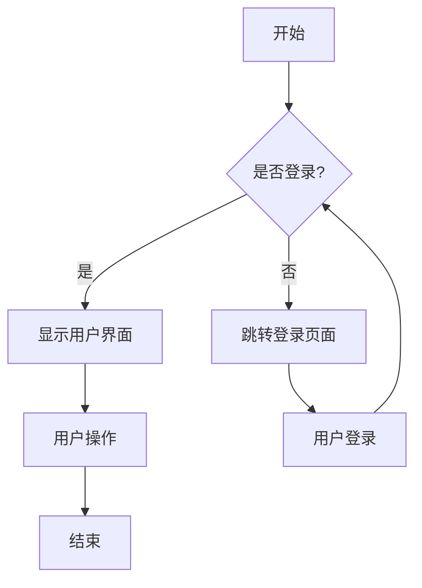
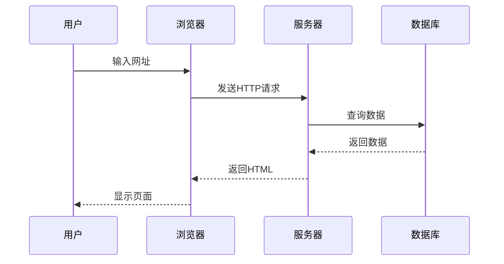
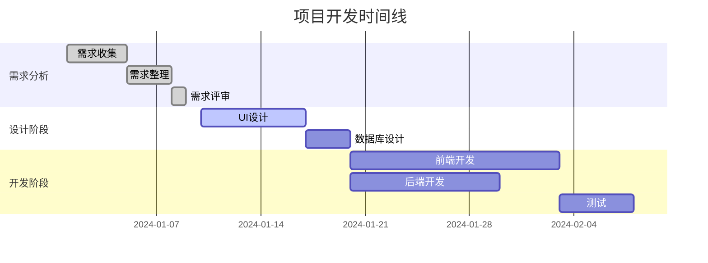

# 图表和代码渲染演示

这是一个演示各种图表和增强代码渲染功能的文档。

## 1. Mermaid 图表支持

### 流程图 (graph)



### 序列图 (sequenceDiagram)



### 甘特图 (gantt)



## 2. ECharts 数据可视化

### 柱状图示例

```echarts
{
  "title": {
    "text": "月度访问量统计",
    "left": "center"
  },
  "tooltip": {
    "trigger": "axis"
  },
  "xAxis": {
    "type": "category",
    "data": ["1月", "2月", "3月", "4月", "5月", "6月"]
  },
  "yAxis": {
    "type": "value"
  },
  "series": [{
    "data": [820, 932, 901, 934, 1290, 1330],
    "type": "bar",
    "itemStyle": {
      "color": "#3b82f6"
    }
  }]
}
```

### 折线图示例

```echarts
{
  "title": {
    "text": "用户增长趋势",
    "left": "center"
  },
  "tooltip": {
    "trigger": "axis"
  },
  "legend": {
    "data": ["新用户", "活跃用户"],
    "top": "30"
  },
  "xAxis": {
    "type": "category",
    "data": ["1月", "2月", "3月", "4月", "5月", "6月"]
  },
  "yAxis": {
    "type": "value"
  },
  "series": [
    {
      "name": "新用户",
      "type": "line",
      "data": [120, 132, 101, 134, 90, 230],
      "itemStyle": {
        "color": "#10b981"
      }
    },
    {
      "name": "活跃用户",
      "type": "line",
      "data": [220, 182, 191, 234, 290, 330],
      "itemStyle": {
        "color": "#3b82f6"
      }
    }
  ]
}
```

### 饼图示例

```echarts
{
  "title": {
    "text": "设备类型分布",
    "left": "center"
  },
  "tooltip": {
    "trigger": "item",
    "formatter": "{a} <br/>{b}: {c} ({d}%)"
  },
  "series": [{
    "name": "设备类型",
    "type": "pie",
    "radius": "50%",
    "data": [
      {"value": 335, "name": "桌面端"},
      {"value": 310, "name": "移动端"},
      {"value": 234, "name": "平板端"},
      {"value": 135, "name": "其他"}
    ],
    "itemStyle": {
      "color": function(params) {
        var colors = ["#3b82f6", "#10b981", "#f59e0b", "#ef4444"];
        return colors[params.dataIndex];
      }
    }
  }]
}
```

## 3. 增强代码渲染

### JavaScript 代码（带语法高亮、行号、复制功能）

```javascript
// React 函数组件示例
import React, { useState, useEffect } from 'react';

const UserProfile = ({ userId }) => {
  const [user, setUser] = useState(null);
  const [loading, setLoading] = useState(true);
  const [error, setError] = useState(null);

  useEffect(() => {
    const fetchUser = async () => {
      try {
        setLoading(true);
        const response = await fetch(`/api/users/${userId}`);
        
        if (!response.ok) {
          throw new Error('用户数据获取失败');
        }
        
        const userData = await response.json();
        setUser(userData);
      } catch (err) {
        setError(err.message);
      } finally {
        setLoading(false);
      }
    };

    if (userId) {
      fetchUser();
    }
  }, [userId]);

  if (loading) return <div className="loading">加载中...</div>;
  if (error) return <div className="error">错误: {error}</div>;
  if (!user) return <div className="no-data">未找到用户</div>;

  return (
    <div className="user-profile">
      
      <h2>{user.name}</h2>
      <p>{user.email}</p>
      <p>注册时间: {new Date(user.createdAt).toLocaleDateString()}</p>
    </div>
  );
};

export default UserProfile;
```

### Python 代码示例

```python
import asyncio
import aiohttp
from typing import List, Dict, Optional
from dataclasses import dataclass
from datetime import datetime

@dataclass
class User:
    id: int
    name: str
    email: str
    created_at: datetime
    
    def to_dict(self) -> Dict:
        return {
            'id': self.id,
            'name': self.name,
            'email': self.email,
            'created_at': self.created_at.isoformat()
        }

class UserService:
    def __init__(self, api_url: str):
        self.api_url = api_url
        self.session: Optional[aiohttp.ClientSession] = None
    
    async def __aenter__(self):
        self.session = aiohttp.ClientSession()
        return self
    
    async def __aexit__(self, exc_type, exc_val, exc_tb):
        if self.session:
            await self.session.close()
    
    async def get_user(self, user_id: int) -> Optional[User]:
        """获取单个用户信息"""
        if not self.session:
            raise RuntimeError("UserService must be used as async context manager")
        
        try:
            async with self.session.get(f"{self.api_url}/users/{user_id}") as response:
                if response.status == 200:
                    data = await response.json()
                    return User(
                        id=data['id'],
                        name=data['name'],
                        email=data['email'],
                        created_at=datetime.fromisoformat(data['created_at'])
                    )
                elif response.status == 404:
                    return None
                else:
                    response.raise_for_status()
        except aiohttp.ClientError as e:
            print(f"获取用户 {user_id} 失败: {e}")
            return None
    
    async def get_users(self, limit: int = 10) -> List[User]:
        """获取用户列表"""
        users = []
        
        try:
            async with self.session.get(f"{self.api_url}/users", params={'limit': limit}) as response:
                if response.status == 200:
                    data = await response.json()
                    for user_data in data['users']:
                        user = User(
                            id=user_data['id'],
                            name=user_data['name'],
                            email=user_data['email'],
                            created_at=datetime.fromisoformat(user_data['created_at'])
                        )
                        users.append(user)
        except aiohttp.ClientError as e:
            print(f"获取用户列表失败: {e}")
        
        return users

# 使用示例
async def main():
    api_url = "https://api.example.com"
    
    async with UserService(api_url) as service:
        # 获取单个用户
        user = await service.get_user(123)
        if user:
            print(f"用户: {user.name} ({user.email})")
        
        # 获取用户列表
        users = await service.get_users(20)
        print(f"共获取到 {len(users)} 个用户")
        
        for user in users:
            print(f"- {user.name}: {user.email}")

if __name__ == "__main__":
    asyncio.run(main())
```

### SQL 代码示例

```sql
-- 用户表结构
CREATE TABLE users (
    id SERIAL PRIMARY KEY,
    username VARCHAR(50) UNIQUE NOT NULL,
    email VARCHAR(100) UNIQUE NOT NULL,
    password_hash VARCHAR(255) NOT NULL,
    full_name VARCHAR(100),
    avatar_url VARCHAR(255),
    bio TEXT,
    created_at TIMESTAMP WITH TIME ZONE DEFAULT CURRENT_TIMESTAMP,
    updated_at TIMESTAMP WITH TIME ZONE DEFAULT CURRENT_TIMESTAMP,
    last_login_at TIMESTAMP WITH TIME ZONE,
    is_active BOOLEAN DEFAULT true,
    email_verified BOOLEAN DEFAULT false
);

-- 文章表结构
CREATE TABLE posts (
    id SERIAL PRIMARY KEY,
    title VARCHAR(200) NOT NULL,
    slug VARCHAR(200) UNIQUE NOT NULL,
    content TEXT NOT NULL,
    excerpt TEXT,
    featured_image VARCHAR(255),
    author_id INTEGER REFERENCES users(id) ON DELETE CASCADE,
    category_id INTEGER REFERENCES categories(id) ON DELETE SET NULL,
    status VARCHAR(20) DEFAULT 'draft' CHECK (status IN ('draft', 'published', 'archived')),
    published_at TIMESTAMP WITH TIME ZONE,
    created_at TIMESTAMP WITH TIME ZONE DEFAULT CURRENT_TIMESTAMP,
    updated_at TIMESTAMP WITH TIME ZONE DEFAULT CURRENT_TIMESTAMP,
    view_count INTEGER DEFAULT 0,
    like_count INTEGER DEFAULT 0
);

-- 复杂查询示例：获取最受欢迎的文章及其作者信息
WITH popular_posts AS (
    SELECT 
        p.id,
        p.title,
        p.slug,
        p.excerpt,
        p.view_count,
        p.like_count,
        p.published_at,
        p.author_id,
        ROW_NUMBER() OVER (ORDER BY (p.view_count * 0.7 + p.like_count * 0.3) DESC) as rank
    FROM posts p
    WHERE p.status = 'published' 
        AND p.published_at >= CURRENT_DATE - INTERVAL '30 days'
),
author_stats AS (
    SELECT 
        u.id,
        u.username,
        u.full_name,
        u.avatar_url,
        COUNT(p.id) as total_posts,
        AVG(p.view_count) as avg_views,
        MAX(p.published_at) as last_post_date
    FROM users u
    LEFT JOIN posts p ON u.id = p.author_id AND p.status = 'published'
    GROUP BY u.id, u.username, u.full_name, u.avatar_url
)
SELECT 
    pp.rank,
    pp.title,
    pp.slug,
    pp.excerpt,
    pp.view_count,
    pp.like_count,
    pp.published_at,
    as_.username as author_username,
    as_.full_name as author_name,
    as_.avatar_url as author_avatar,
    as_.total_posts as author_total_posts,
    as_.avg_views as author_avg_views,
    CASE 
        WHEN pp.view_count > as_.avg_views THEN '高于平均'
        WHEN pp.view_count = as_.avg_views THEN '等于平均'
        ELSE '低于平均'
    END as performance_vs_author_avg
FROM popular_posts pp
JOIN author_stats as_ ON pp.author_id = as_.id
WHERE pp.rank <= 10
ORDER BY pp.rank;

-- 创建索引优化查询性能
CREATE INDEX idx_posts_status_published_at ON posts(status, published_at DESC) WHERE status = 'published';
CREATE INDEX idx_posts_author_id ON posts(author_id);
CREATE INDEX idx_posts_category_id ON posts(category_id);
CREATE INDEX idx_posts_view_count ON posts(view_count DESC);
CREATE INDEX idx_posts_slug ON posts(slug) WHERE status = 'published';

-- 触发器：自动更新 updated_at 字段
CREATE OR REPLACE FUNCTION update_updated_at_column()
RETURNS TRIGGER AS $$
BEGIN
    NEW.updated_at = CURRENT_TIMESTAMP;
    RETURN NEW;
END;
$$ language 'plpgsql';

CREATE TRIGGER update_users_updated_at BEFORE UPDATE ON users
    FOR EACH ROW EXECUTE FUNCTION update_updated_at_column();

CREATE TRIGGER update_posts_updated_at BEFORE UPDATE ON posts
    FOR EACH ROW EXECUTE FUNCTION update_updated_at_column();
```

## 功能特性说明

1. **Mermaid 图表支持**：
   - 支持流程图 (graph)
   - 支持序列图 (sequenceDiagram)  
   - 支持甘特图 (gantt)
   - 自动渲染和主题配置

2. **ECharts 数据可视化**：
   - 支持柱状图、折线图、饼图等
   - JSON 配置格式
   - 响应式设计
   - 自定义样式和颜色

3. **增强代码渲染**：
   - 语法高亮（支持多种编程语言）
   - 行号显示
   - 一键复制功能
   - 语言标识
   - 响应式设计

所有功能都已集成到 Markdown 渲染系统中，只需在代码块中指定相应的语言标识即可使用。